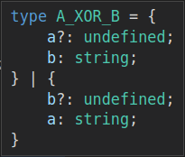

# ts-xor

Compose custom types containing mutually exclusive keys, using this generic Typescript helper type.

[](https://www.npmjs.com/package/ts-xor)
[](LICENCE.md)

[](https://npm-stat.com/charts.html?package=ts-xor&from=2019-02-22)
[](https://npm-stat.com/charts.html?package=ts-xor&from=2019-02-22)
[](https://github.com/maninak/ts-xor/network/dependents)
[](https://github.com/maninak/ts-xor/stargazers)

[](https://bundlephobia.com/result?p=ts-xor)
[](https://github.com/maninak/ts-xor/blob/87aa237a1b246efa4e8028d89dc7168ba4c4fd84/package.json#L30)

## Description

Typescript's union operator (`|`) allows combining two object types `A` and `B`, into a superset type C which _can_ contain all the members of both `A` and `B`.

But sometimes the requirements dictate that we combine two types with mutually exclusive members. So take the members `A.a` and `B.b`. Given `type C = A | B` then we want to impose the restriction that we can set _either_ `C.a` _or_ `C.b` _but never both_ AND _always at least one of the two_!

Typescript does not have this feature built-in.

The package `ts-xor` introduces the new custom type `XOR`. You can use XOR to compose your own custom types with mutually exclusive members.

The XOR type effectively implements the well-known XOR logical operator from boolean algebra as defined by the following truth table:

| A | B | Result | Note
| :-: | :-: | :-: | :-: |
| 0 | 0 | 0 | achievable with union operator (`\|`) and `XOR`
| 0 | 1 | 1 | achievable with union operator (`\|`) and `XOR`
| 1 | 0 | 1 | achievable with union operator (`\|`) and `XOR`
| 1 | 1 | 0 | achievable only with `XOR`

### Union operator vs the XOR type in practice

If we use the union operator

```ts
type A_OR_B = A | B
```

then the derived type is shown in VS Code like so:


Whereas if we use the XOR mapped type

```ts
type A_XOR_B = XOR<A, B>
```

then the derived type is shown quite differently in VS Code:



Notice that when using XOR each "variant" of the resulting type contains all keys of one source type plus all keys of the other, with those of the second type defined as _optional_ and at the same time typed as _undefined_.

This trick will not only forbid defining keys of both source types at the same time (since the type of each key is explicitly `undefined`), but also _allow_ us to not need to define all keys all of the time since each set of keys is optional on each variant.

## Installation

In your typescript powered, npm project, run:

```sh
npm install -D ts-xor # yarn add -D ts-xor
```

## Examples

### A simple example

```typescript
// example1.ts

import { XOR } from 'ts-xor'

interface A {
  a: string
}

interface B {
  b: string
}

let test: XOR<A, B>

test = { a: '' }         // OK
test = { b: '' }         // OK
test = { a: '', b: '' }  // rejected
test = {}                // rejected
```

### A real-life example

Let's assume that we have the following spec for a weather forecast API's response:

1. A weather forecast object _always_ contains the `id` _and_ `station` members
2. A weather forecast object _always_ contains either a member `rain` _or_ a member `snow`, but _never_ both at the same time.
3. The rain, snow members are objects containing additional forecast accuracy data
4. The rain, snow members _always_ contain either a member `1h` or a member `3h` with a number value, but _never_ both keys at the same time.

```typescript
// example2.ts

import { XOR } from 'ts-xor'

type ForecastAccuracy = XOR<{ '1h': number }, { '3h': number }>

interface WeatherForecastBase {
  id: number
  station: string
}

interface WeatherForecastWithRain extends WeatherForecastBase {
  rain: ForecastAccuracy
}

interface WeatherForecastWithSnow extends WeatherForecastBase {
  snow: ForecastAccuracy
}

type WeatherForecast = XOR<WeatherForecastWithRain, WeatherForecastWithSnow>

const test: WeatherForecast = {
  id: 1,
  station: 'Acropolis',
  // rain: { '1h': 1 },           // OK
  // rain: { '2h': 1 },           // rejected
  // rain: { '3h': 1 },           // OK
  // rain: {},                    // rejected
  // rain: { '1h': 1 , '3h': 3 }, // rejected
  // lel: { '3h': 1 },            // rejected
  // rain: { '3h': 1, lel: 1 },   // rejected
  // snow: { '3h': 1 },           // OK
                                  // rejected when BOTH `rain` AND `snow` keys are defined at the same time
}
```

### XORing more than two types

If you want to create a type as the product of the logical XOR operation between multiple types (more than two), then nest the generic params.

```typescript
// example1.ts

import { XOR } from 'ts-xor'

interface A {
  a: string
}

interface B {
  b: string
}

interface C {
  c: string
}

let test: XOR<A, XOR<B, C>>

test = { a: '' }         // OK
test = { b: '' }         // OK
test = { c: '' }         // OK
test = { a: '', c: '' }  // rejected
test = {}                // rejected
```

## Tests and Coverage

The library `ts-xor` is fully covered with smoke, acceptance and mutation tests against the typescript compiler itself. The tests can be found inside the [`test`](https://github.com/maninak/ts-xor/tree/master/test) folder.

To run all tests locally, execute the following command inside your git-cloned `ts-xor` folder:

```sh
npm run test
```

## NPM

This library is [published on NPM](https://www.npmjs.com/package/ts-xor).

## Licence

Distributed under the MIT license. See [`LICENSE.md`](./LICENCE.md) for more information.

## Contributing

This project's commits comply with the [Conventional Commits](https://www.conventionalcommits.org/) guidelines.

1. Fork it (<https://github.com/maninak/ts-xor/fork>)
2. Create your feature/fix branch (`git checkout -b feat/foobar`)
3. Commit your changes (`git commit -am 'feat(foobar): add support for foobar tricks'`)
4. Push to the branch (`git push origin feat/fooBar`)
5. Create a new Pull Request
